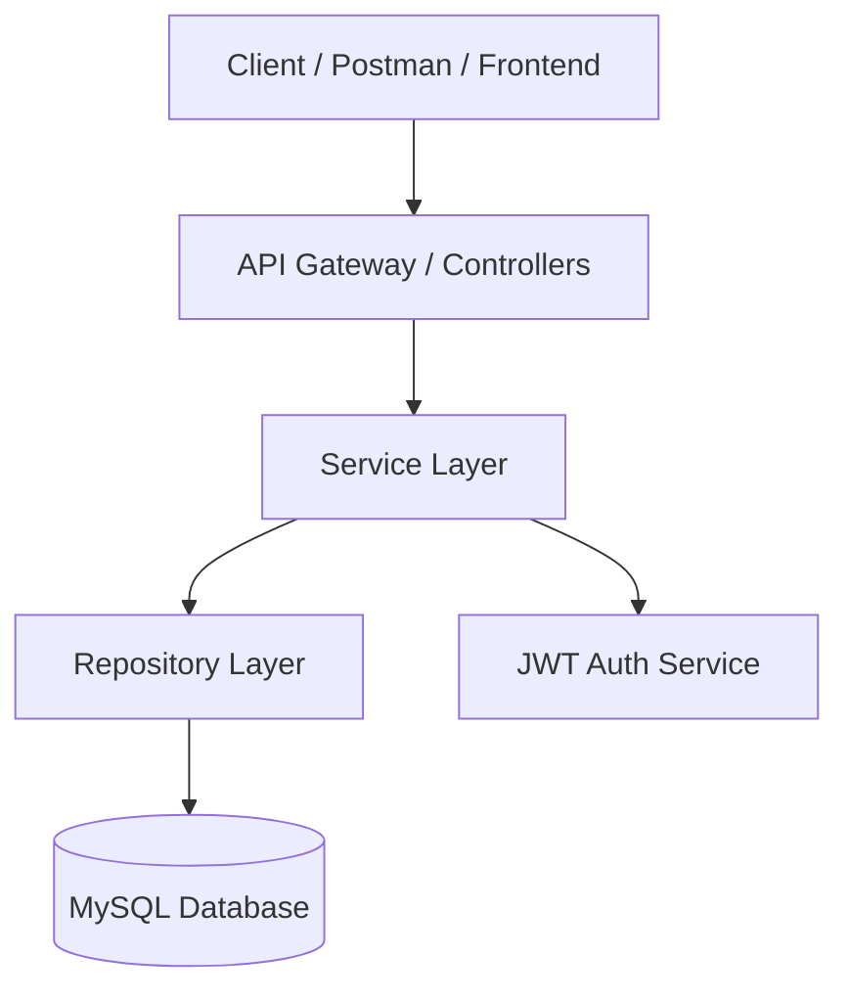
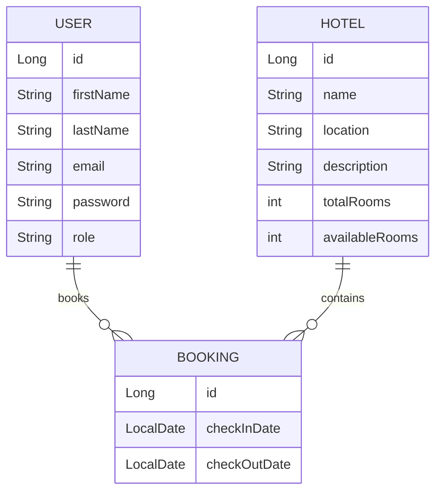

# 🏨 Hotel Room Booking API

### **A RESTful API built with Spring Boot & JWT Authentication**

This project provides a full backend system for managing hotel rooms and customer bookings for a hotel aggregator platform.
It includes secure authentication, role-based authorization, booking management, and hotel administration operations.

---

## 🎯 Problem Statement

Develop a **RESTful API service** using **Spring Boot**, implementing **JWT-based authentication** and **MySQL** persistence to streamline the room booking process for a hotel management aggregator application.

The solution must support secure handling of hotel data, bookings, and different user roles (Customer, Hotel Manager, Admin).

---

## ✨ Key Features Delivered

* 🔐 **JWT-based Authentication & Authorization**
* 👥 **Role-based Access Control** — Customer, Hotel Manager, Admin
* 🏨 **Hotel Management** – Create, update, list, and delete hotels
* 📖 **Booking Management** – Book and cancel rooms with validations
* 📅 **Strict Booking Rules**

  * Check-in must be a future date
  * Check-out must be after check-in
  * Prevent overbooking based on room availability
* 📦 **Layered Architecture** (Controller → Service → Repository → Entity)
* 🧪 **Unit Tests using MockMvc & Mockito**
* 📌 **Meaningful Incremental Commit History**
* 📝 **Complete API Documentation**
* 🧾 **Public Postman Collection**
---

## 📂 Postman Collection

**Option - 1**

Access the Learning Navigator API collection using the link below.
**[Importer Link to Postman Collection](https://www.postman.com/navigation-participant-9941289/workspace/collections/collection/37160902-2b9ee08a-7532-4a7f-94c7-6a6c7e8e21a0?action=share&creator=37160902)**

**Option - 2**

Postman collection file included in postman/StayEase.postman_collection.json

Import the collection to test all endpoints quickly

## 👤 User Roles & Permissions

| Role              | Permissions                           |
| ----------------- | ------------------------------------- |
| **Admin**         | Create & delete hotels                |
| **Hotel Manager** | Update hotel details, cancel bookings |
| **Customer**      | Book rooms, view booking details      |
| **Public Users**  | Registration & Login                  |

---

## 🏗 System Architecture



---

## 🗄 Database Design



---

## 🚀 Technology Stack

| Category         | Technology                  |
| --------------   | --------------------------- |
| Backend          | Spring Boot                 |
| Database         | MySQL                       |
| Authentication   | JWT                         |
| ORM              | Spring Data JPA             |
| Build Tool       | Gradle                      |
| Testing          | JUnit, Mockito, MockMvc     |
| Api Testing Tool | Postman                     |

---

## 🌍 Base URL

```
http://localhost:8081/
```

---

## 🔗 API Endpoints Overview

| Category            | Endpoint                    | Method | Role     |
| ------------------- | --------------------------- | ------ | -------- |
| Register User       | `/api/users/register`       | POST   | Public   |
| Login               | `/api/users/login`          | POST   | Public   |
| Create Hotel        | `/api/hotels`               | POST   | Admin    |
| Get All Hotels      | `/api/hotels`               | GET    | Public   |
| Update Hotel        | `/api/hotels/{id}`          | PUT    | Manager  |
| Delete Hotel        | `/api/hotels/{id}`          | DELETE | Admin    |
| Create Booking      | `/api/bookings/{hotelId}`   | POST   | Customer |
| Get Booking Details | `/api/bookings/{bookingId}` | GET    | Customer |
| Cancel Booking      | `/api/bookings/{bookingId}` | DELETE | Manager  |

---

## 🧪 Testing Requirements (Completed)

| Type          | Tool                      |
| ------------- | ------------------------- |
| Unit Tests    | JUnit                     |
| Mocking       | Mockito                   |
| API Testing   | MockMvc                   |

---


## 📁 Repository & Documentation Included

* ✔ Clean Commit History (Conventional Commits)
* ✔ Detailed README
* ✔ Public Postman Collection
* ✔ Deployment-ready JAR instructions

---

## 🏆 Result

All required features were successfully implemented, tested, and documented according to the project constraints and design expectations.